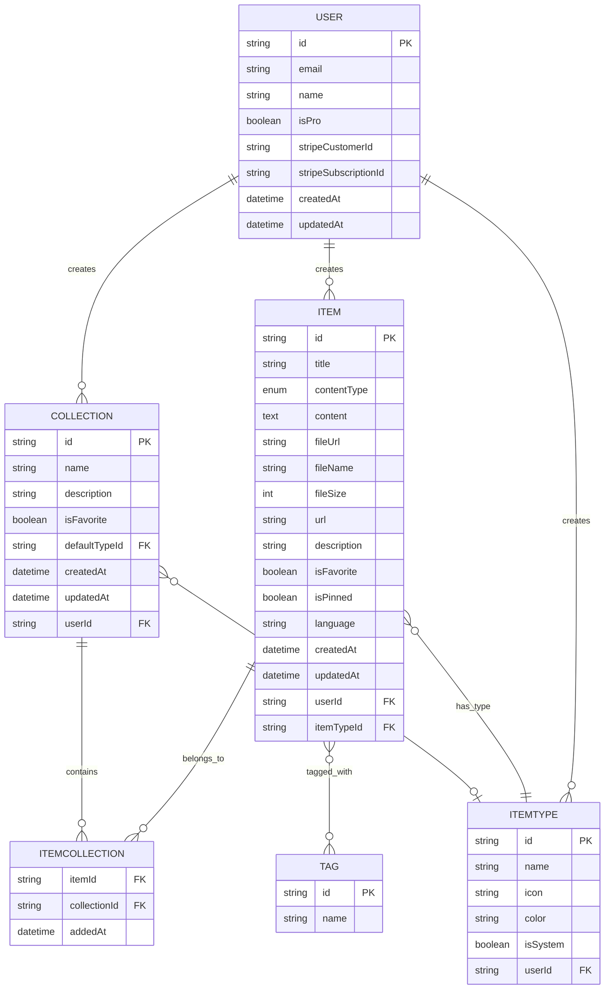
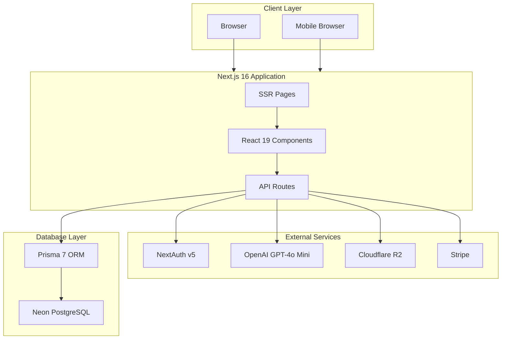
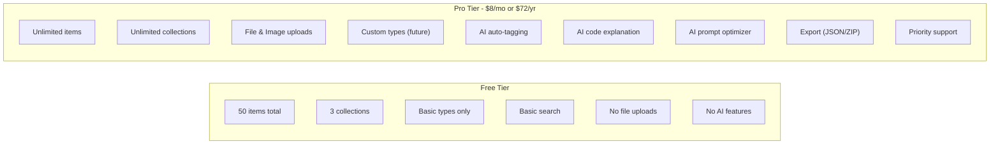

# DevStash - Project Overview

> A unified hub for developer knowledge & resources

---

## 📋 Table of Contents

- [Problem Statement](#-problem-statement)
- [Target Users](#-target-users)
- [Features](#-features)
- [Data Architecture](#-data-architecture)
- [Tech Stack](#-tech-stack)
- [Monetization](#-monetization)
- [UI/UX Guidelines](#-uiux-guidelines)

---

## 🎯 Problem Statement

Developers keep their essentials scattered across multiple tools and locations:

| Resource      | Common Location          |
| ------------- | ------------------------ |
| Code snippets | VS Code, Notion, Gists   |
| AI prompts    | Chat histories           |
| Context files | Buried in projects       |
| Useful links  | Browser bookmarks        |
| Documentation | Random folders           |
| Commands      | .txt files, bash history |
| Templates     | GitHub Gists             |

**The Result:** Context switching, lost knowledge, and inconsistent workflows.

**The Solution:** DevStash provides ONE fast, searchable, AI-enhanced hub for all developer knowledge & resources.

---

## 👥 Target Users

| User Type                      | Primary Needs                                      |
| ------------------------------ | -------------------------------------------------- |
| **Everyday Developer**         | Fast access to snippets, prompts, commands, links  |
| **AI-First Developer**         | Save prompts, contexts, workflows, system messages |
| **Content Creator / Educator** | Store code blocks, explanations, course notes      |
| **Full-Stack Builder**         | Collect patterns, boilerplates, API examples       |

---

## ✨ Features

### A. Items & Item Types

Items are the core unit of DevStash. Each item has a type that determines its behavior and appearance.

#### System Types (Immutable)

| Type       | Icon         | Color               | Content Type | Route             |
| ---------- | ------------ | ------------------- | ------------ | ----------------- |
| 🔷 Snippet | `Code`       | `#3b82f6` (blue)    | Text         | `/items/snippets` |
| 🟣 Prompt  | `Sparkles`   | `#8b5cf6` (purple)  | Text         | `/items/prompts`  |
| 🟠 Command | `Terminal`   | `#f97316` (orange)  | Text         | `/items/commands` |
| 🟡 Note    | `StickyNote` | `#fde047` (yellow)  | Text         | `/items/notes`    |
| ⚫ File    | `File`       | `#6b7280` (gray)    | File         | `/items/files`    |
| 🩷 Image   | `Image`      | `#ec4899` (pink)    | File         | `/items/images`   |
| 🟢 Link    | `Link`       | `#10b981` (emerald) | URL          | `/items/links`    |

> **Note:** File and Image types are Pro-only features.

### B. Collections

Users can organize items into collections. Items support many-to-many relationships with collections.

**Examples:**

- React Patterns (snippets, notes)
- Context Files (files)
- Python Snippets (snippets)
- Interview Prep (mixed types)

### C. Search

Powerful search across:

- Content
- Tags
- Titles
- Types

### D. Authentication

- Email/password authentication
- GitHub OAuth sign-in
- Powered by NextAuth v5

### E. Core Features

- ⭐ Collection and item favorites
- 📌 Pin items to top
- 🕐 Recently used items
- 📥 Import code from file
- ✍️ Markdown editor for text types
- 📤 File upload for file types
- 💾 Export data (JSON/ZIP)
- 🌙 Dark mode (default)
- 🏷️ Multi-collection item assignment
- 👁️ View item's collection memberships

### F. AI Features (Pro Only)

- 🤖 AI auto-tag suggestions
- 📝 AI summaries
- 💡 AI "Explain This Code"
- ⚡ Prompt optimizer

---

## 🗄️ Data Architecture

### Entity Relationship Diagram



### Prisma Schema

```prisma
// prisma/schema.prisma

generator client {
  provider = "prisma-client-js"
}

datasource db {
  provider = "postgresql"
  url      = env("DATABASE_URL")
}

// ============================================
// USER
// ============================================
model User {
  id                   String       @id @default(cuid())
  email                String       @unique
  emailVerified        DateTime?
  name                 String?
  image                String?
  password             String?
  isPro                Boolean      @default(false)
  stripeCustomerId     String?      @unique
  stripeSubscriptionId String?      @unique
  createdAt            DateTime     @default(now())
  updatedAt            DateTime     @updatedAt

  // Relations
  items       Item[]
  collections Collection[]
  itemTypes   ItemType[]
  accounts    Account[]
  sessions    Session[]

  @@map("users")
}

// ============================================
// NEXTAUTH MODELS
// ============================================
model Account {
  id                String  @id @default(cuid())
  userId            String
  type              String
  provider          String
  providerAccountId String
  refresh_token     String? @db.Text
  access_token      String? @db.Text
  expires_at        Int?
  token_type        String?
  scope             String?
  id_token          String? @db.Text
  session_state     String?

  user User @relation(fields: [userId], references: [id], onDelete: Cascade)

  @@unique([provider, providerAccountId])
  @@map("accounts")
}

model Session {
  id           String   @id @default(cuid())
  sessionToken String   @unique
  userId       String
  expires      DateTime

  user User @relation(fields: [userId], references: [id], onDelete: Cascade)

  @@map("sessions")
}

model VerificationToken {
  identifier String
  token      String   @unique
  expires    DateTime

  @@unique([identifier, token])
  @@map("verification_tokens")
}

// ============================================
// ITEM
// ============================================
enum ContentType {
  TEXT
  FILE
  URL
}

model Item {
  id          String      @id @default(cuid())
  title       String
  contentType ContentType
  content     String?     @db.Text // For TEXT types
  fileUrl     String?     // R2 URL for FILE types
  fileName    String?     // Original filename
  fileSize    Int?        // Size in bytes
  url         String?     // For URL/link types
  description String?     @db.Text
  isFavorite  Boolean     @default(false)
  isPinned    Boolean     @default(false)
  language    String?     // Programming language for syntax highlighting
  createdAt   DateTime    @default(now())
  updatedAt   DateTime    @updatedAt

  // Relations
  userId     String
  user       User     @relation(fields: [userId], references: [id], onDelete: Cascade)
  itemTypeId String
  itemType   ItemType @relation(fields: [itemTypeId], references: [id])
  tags       Tag[]    @relation("ItemTags")

  // Many-to-many with collections
  collections ItemCollection[]

  @@index([userId])
  @@index([itemTypeId])
  @@index([createdAt])
  @@map("items")
}

// ============================================
// ITEM TYPE
// ============================================
model ItemType {
  id       String  @id @default(cuid())
  name     String
  icon     String
  color    String
  isSystem Boolean @default(false)

  // Relations
  userId String?
  user   User?   @relation(fields: [userId], references: [id], onDelete: Cascade)
  items  Item[]

  // Collections that use this as default type
  defaultForCollections Collection[]

  @@unique([name, userId])
  @@map("item_types")
}

// ============================================
// COLLECTION
// ============================================
model Collection {
  id          String   @id @default(cuid())
  name        String
  description String?  @db.Text
  isFavorite  Boolean  @default(false)
  createdAt   DateTime @default(now())
  updatedAt   DateTime @updatedAt

  // Relations
  userId        String
  user          User      @relation(fields: [userId], references: [id], onDelete: Cascade)
  defaultTypeId String?
  defaultType   ItemType? @relation(fields: [defaultTypeId], references: [id])

  // Many-to-many with items
  items ItemCollection[]

  @@index([userId])
  @@map("collections")
}

// ============================================
// ITEM-COLLECTION JOIN TABLE
// ============================================
model ItemCollection {
  itemId       String
  collectionId String
  addedAt      DateTime @default(now())

  item       Item       @relation(fields: [itemId], references: [id], onDelete: Cascade)
  collection Collection @relation(fields: [collectionId], references: [id], onDelete: Cascade)

  @@id([itemId, collectionId])
  @@map("item_collections")
}

// ============================================
// TAG
// ============================================
model Tag {
  id    String @id @default(cuid())
  name  String @unique
  items Item[] @relation("ItemTags")

  @@map("tags")
}
```

### Seed Data for System Types

```typescript
// prisma/seed.ts

import { PrismaClient } from '@prisma/client';

const prisma = new PrismaClient();

const systemItemTypes = [
  { name: 'snippet', icon: 'Code', color: '#3b82f6', isSystem: true },
  { name: 'prompt', icon: 'Sparkles', color: '#8b5cf6', isSystem: true },
  { name: 'command', icon: 'Terminal', color: '#f97316', isSystem: true },
  { name: 'note', icon: 'StickyNote', color: '#fde047', isSystem: true },
  { name: 'file', icon: 'File', color: '#6b7280', isSystem: true },
  { name: 'image', icon: 'Image', color: '#ec4899', isSystem: true },
  { name: 'link', icon: 'Link', color: '#10b981', isSystem: true },
];

async function main() {
  console.log('Seeding system item types...');

  for (const type of systemItemTypes) {
    await prisma.itemType.upsert({
      where: { name_userId: { name: type.name, userId: null } },
      update: {},
      create: type,
    });
  }

  console.log('Seeding complete!');
}

main()
  .catch((e) => {
    console.error(e);
    process.exit(1);
  })
  .finally(async () => {
    await prisma.$disconnect();
  });
```

---

## 🛠️ Tech Stack

### Architecture Diagram



### Technology Choices

| Category           | Technology                  | Notes                                  |
| ------------------ | --------------------------- | -------------------------------------- |
| **Framework**      | Next.js 16 / React 19       | SSR pages, API routes, single codebase |
| **Language**       | TypeScript                  | Type safety throughout                 |
| **Database**       | Neon PostgreSQL             | Serverless Postgres                    |
| **ORM**            | Prisma 7                    | Latest version with full type safety   |
| **File Storage**   | Cloudflare R2               | S3-compatible object storage           |
| **Authentication** | NextAuth v5                 | Email/password + GitHub OAuth          |
| **AI**             | OpenAI GPT-4o Mini          | Cost-effective for AI features         |
| **Styling**        | Tailwind CSS v4 + shadcn/ui | Modern, accessible components          |
| **Payments**       | Stripe                      | Subscriptions & billing                |

### Important Development Notes

> ⚠️ **Database Migrations**
>
> **NEVER** use `prisma db push` or directly update the database structure.
>
> Always create migrations that run in development first, then production:
>
> ```bash
> # Create migration
> npx prisma migrate dev --name <migration_name>
>
> # Apply to production
> npx prisma migrate deploy
> ```

### Recommended Links

- [Next.js Documentation](https://nextjs.org/docs)
- [Prisma Documentation](https://www.prisma.io/docs)
- [NextAuth.js Documentation](https://authjs.dev)
- [Tailwind CSS v4](https://tailwindcss.com/docs)
- [shadcn/ui Components](https://ui.shadcn.com)
- [Neon PostgreSQL](https://neon.tech/docs)
- [Cloudflare R2](https://developers.cloudflare.com/r2)
- [Stripe Subscriptions](https://stripe.com/docs/billing/subscriptions)

---

## 💰 Monetization

### Pricing Tiers



### Feature Comparison

| Feature                                   | Free |      Pro       |
| ----------------------------------------- | :--: | :------------: |
| Items                                     |  50  |   Unlimited    |
| Collections                               |  3   |   Unlimited    |
| Snippets, Prompts, Commands, Notes, Links |  ✅  |       ✅       |
| Files & Images                            |  ❌  |       ✅       |
| Basic Search                              |  ✅  |       ✅       |
| Custom Types                              |  ❌  | 🔜 Coming Soon |
| AI Auto-tagging                           |  ❌  |       ✅       |
| AI Code Explanation                       |  ❌  |       ✅       |
| AI Prompt Optimizer                       |  ❌  |       ✅       |
| Data Export                               |  ❌  |       ✅       |
| Priority Support                          |  ❌  |       ✅       |

> **Development Note:** During development, all users can access all features. Pro gating will be enabled before launch.

---

## 🎨 UI/UX Guidelines

### Design Principles

- **Modern & Minimal** - Developer-focused aesthetic
- **Dark Mode Default** - Light mode optional
- **Clean Typography** - Generous whitespace
- **Subtle Accents** - Borders and shadows used sparingly
- **Syntax Highlighting** - For all code blocks

### Design References

- [Notion](https://notion.so) - Clean organization
- [Linear](https://linear.app) - Modern dev aesthetic
- [Raycast](https://raycast.com) - Quick access patterns

### Screenshots

Refer to the screenshots below as a base for the dashboard UI. It does not have to be exact. Use it as a reference:

- @context/screenshots/dashboard-ui-main.png
- @context/screenshots/dashboard-ui-drawer.png

### Layout Structure

```
┌─────────────────────────────────────────────────────────────┐
│  DevStash                                    🔍  ⚙️  👤     │
├──────────────┬──────────────────────────────────────────────┤
│              │                                              │
│  TYPES       │  Collections                                 │
│  ─────────   │  ┌────────┐ ┌────────┐ ┌────────┐           │
│  📝 Snippets │  │ React  │ │ Python │ │Context │           │
│  ✨ Prompts  │  │Patterns│ │Snippets│ │ Files  │           │
│  ⌨️ Commands │  └────────┘ └────────┘ └────────┘           │
│  📒 Notes    │                                              │
│  📁 Files    │  Recent Items                                │
│  🖼️ Images   │  ┌──────────────────────────────────────┐   │
│  🔗 Links    │  │ 🔷 useAuth hook snippet              │   │
│              │  ├──────────────────────────────────────┤   │
│  ─────────   │  │ 🟣 Code review prompt                │   │
│  COLLECTIONS │  ├──────────────────────────────────────┤   │
│  React...    │  │ 🟠 git reset --hard HEAD~1           │   │
│  Python...   │  └──────────────────────────────────────┘   │
│              │                                              │
└──────────────┴──────────────────────────────────────────────┘
```

### Type Colors (CSS Variables)

```css
:root {
  --color-snippet: #3b82f6; /* Blue */
  --color-prompt: #8b5cf6; /* Purple */
  --color-command: #f97316; /* Orange */
  --color-note: #fde047; /* Yellow */
  --color-file: #6b7280; /* Gray */
  --color-image: #ec4899; /* Pink */
  --color-link: #10b981; /* Emerald */
}
```

### Icon Mapping (Lucide React)

```typescript
// lib/constants/item-types.ts

import {
  Code,
  Sparkles,
  Terminal,
  StickyNote,
  File,
  Image,
  Link,
} from 'lucide-react';

export const ITEM_TYPE_ICONS = {
  snippet: Code,
  prompt: Sparkles,
  command: Terminal,
  note: StickyNote,
  file: File,
  image: Image,
  link: Link,
} as const;

export const ITEM_TYPE_COLORS = {
  snippet: '#3b82f6',
  prompt: '#8b5cf6',
  command: '#f97316',
  note: '#fde047',
  file: '#6b7280',
  image: '#ec4899',
  link: '#10b981',
} as const;
```

### Responsive Behavior

| Viewport            | Sidebar                    | Layout                         |
| ------------------- | -------------------------- | ------------------------------ |
| Desktop (≥1024px)   | Visible, collapsible       | Full sidebar + main content    |
| Tablet (768-1023px) | Drawer (hidden by default) | Full-width main content        |
| Mobile (<768px)     | Drawer (hidden by default) | Stacked cards, simplified grid |

### Micro-interactions

- **Transitions** - Smooth 150-200ms easing
- **Hover States** - Subtle elevation on cards
- **Toast Notifications** - For CRUD actions
- **Loading States** - Skeleton placeholders
- **Drawer Animations** - Slide-in for item editing

---

## 📁 Suggested Project Structure

```
devstash/
├── app/
│   ├── (auth)/
│   │   ├── login/
│   │   │   └── page.tsx
│   │   ├── register/
│   │   │   └── page.tsx
│   │   ├── forgot-password/
│   │   │   └── page.tsx
│   │   └── layout.tsx
│   │
│   ├── (dashboard)/
│   │   ├── page.tsx
│   │   │
│   │   ├── items/
│   │   │   ├── page.tsx
│   │   │   ├── create/
│   │   │   │   └── page.tsx
│   │   │   └── [type]/
│   │   │       └── page.tsx
│   │   │
│   │   ├── collections/
│   │   │   ├── page.tsx
│   │   │   └── [id]/
│   │   │       └── page.tsx
│   │   │
│   │   ├── search/
│   │   │   └── page.tsx
│   │   │
│   │   ├── settings/
│   │   │   └── page.tsx
│   │   │
│   │   └── layout.tsx
│   │
│   ├── api/
│   │   ├── auth/
│   │   ├── items/
│   │   ├── collections/
│   │   ├── ai/
│   │   ├── upload/
│   │   └── webhooks/
│   │       └── stripe/
│   │
│   ├── layout.tsx
│   ├── loading.tsx
│   ├── error.tsx
│   └── page.tsx
│
├── features/
│   │
│   ├── auth/
│   │   ├── components/
│   │   │   ├── login-form.tsx
│   │   │   ├── register-form.tsx
│   │   │   └── github-button.tsx
│   │   │
│   │   ├── actions/
│   │   │   ├── login.ts
│   │   │   ├── register.ts
│   │   │   └── logout.ts
│   │   │
│   │   ├── hooks/
│   │   │   └── use-auth.ts
│   │   │
│   │   ├── validators/
│   │   │   └── auth.schema.ts
│   │   │
│   │   ├── services/
│   │   │   └── auth.service.ts
│   │   │
│   │   └── types.ts
│   │
│   ├── dashboard/
│   │   ├── components/
│   │   │   ├── dashboard-header.tsx
│   │   │   ├── recent-items.tsx
│   │   │   ├── quick-actions.tsx
│   │   │   └── collections-grid.tsx
│   │   │
│   │   └── hooks/
│   │       └── use-dashboard.ts
│   │
│   ├── items/
│   │   ├── components/
│   │   │   ├── item-card.tsx
│   │   │   ├── item-list.tsx
│   │   │   ├── item-editor.tsx
│   │   │   ├── item-form.tsx
│   │   │   └── item-drawer.tsx
│   │   │
│   │   ├── actions/
│   │   │   ├── create-item.ts
│   │   │   ├── update-item.ts
│   │   │   ├── delete-item.ts
│   │   │   ├── pin-item.ts
│   │   │   └── favorite-item.ts
│   │   │
│   │   ├── hooks/
│   │   │   ├── use-items.ts
│   │   │   ├── use-item.ts
│   │   │   └── use-item-filters.ts
│   │   │
│   │   ├── services/
│   │   │   └── items.service.ts
│   │   │
│   │   ├── validators/
│   │   │   └── item.schema.ts
│   │   │
│   │   ├── constants/
│   │   │   └── item-types.ts
│   │   │
│   │   └── types.ts
│   │
│   ├── collections/
│   │   ├── components/
│   │   │   ├── collection-card.tsx
│   │   │   ├── collection-form.tsx
│   │   │   └── collection-view.tsx
│   │   │
│   │   ├── actions/
│   │   │   ├── create-collection.ts
│   │   │   ├── update-collection.ts
│   │   │   └── delete-collection.ts
│   │   │
│   │   ├── hooks/
│   │   │   └── use-collections.ts
│   │   │
│   │   ├── services/
│   │   │   └── collections.service.ts
│   │   │
│   │   ├── validators/
│   │   │   └── collection.schema.ts
│   │   │
│   │   └── types.ts
│   │
│   ├── tags/
│   │   ├── components/
│   │   ├── hooks/
│   │   ├── services/
│   │   └── types.ts
│   │
│   ├── search/
│   │   ├── components/
│   │   │   ├── search-dialog.tsx
│   │   │   ├── search-input.tsx
│   │   │   └── search-results.tsx
│   │   │
│   │   ├── hooks/
│   │   │   └── use-search.ts
│   │   │
│   │   └── services/
│   │       └── search.service.ts
│   │
│   ├── upload/
│   │   ├── components/
│   │   │   ├── file-upload.tsx
│   │   │   └── image-upload.tsx
│   │   │
│   │   ├── actions/
│   │   │   └── upload-file.ts
│   │   │
│   │   ├── services/
│   │   │   └── r2.service.ts
│   │   │
│   │   └── validators/
│   │       └── upload.schema.ts
│   │
│   ├── ai/
│   │   ├── actions/
│   │   │   ├── explain-code.ts
│   │   │   ├── summarize-item.ts
│   │   │   ├── optimize-prompt.ts
│   │   │   └── generate-tags.ts
│   │   │
│   │   ├── services/
│   │   │   └── ai.service.ts
│   │   │
│   │   └── types.ts
│   │
│   ├── billing/
│   │   ├── components/
│   │   │   ├── pricing-card.tsx
│   │   │   └── billing-portal.tsx
│   │   │
│   │   ├── actions/
│   │   │   ├── create-checkout.ts
│   │   │   └── manage-subscription.ts
│   │   │
│   │   └── services/
│   │       └── stripe.service.ts
│   │
│   └── settings/
│       ├── components/
│       ├── hooks/
│       ├── actions/
│       └── types.ts
│
├── components/
│   ├── ui/
│   │   └── shadcn-components
│   │
│   ├── layout/
│   │   ├── sidebar.tsx
│   │   ├── navbar.tsx
│   │   ├── mobile-drawer.tsx
│   │   └── dashboard-shell.tsx
│   │
│   └── shared/
│       ├── page-header.tsx
│       ├── empty-state.tsx
│       ├── loading-state.tsx
│       ├── search-bar.tsx
│       └── confirm-dialog.tsx
│
├── lib/
│   ├── prisma.ts
│   ├── auth.ts
│   ├── stripe.ts
│   ├── openai.ts
│   ├── r2.ts
│   ├── permissions.ts
│   ├── constants.ts
│   └── utils.ts
│
├── types/
│   ├── api.ts
│   ├── auth.ts
│   └── global.ts
│
├── prisma/
│   ├── schema.prisma
│   ├── migrations/
│   └── seed.ts
│
├── public/
│
├── middleware.ts
├── next.config.ts
├── tsconfig.json
├── package.json
└── .env
```

---

## 🚀 Next Steps

1. [ ] Initialize Next.js 16 project with TypeScript
2. [ ] Set up Prisma with Neon PostgreSQL
3. [ ] Configure NextAuth v5 (email + GitHub)
4. [ ] Create database migrations for initial schema
5. [ ] Seed system item types
6. [ ] Build core UI components with shadcn/ui
7. [ ] Implement items CRUD
8. [ ] Implement collections CRUD
9. [ ] Add search functionality
10. [ ] Set up Cloudflare R2 for file uploads
11. [ ] Integrate Stripe for subscriptions
12. [ ] Add AI features (OpenAI integration)
13. [ ] Implement usage limits for free tier
14. [ ] Testing & polish
15. [ ] Deploy to production

---

_Last updated: January 2025_
